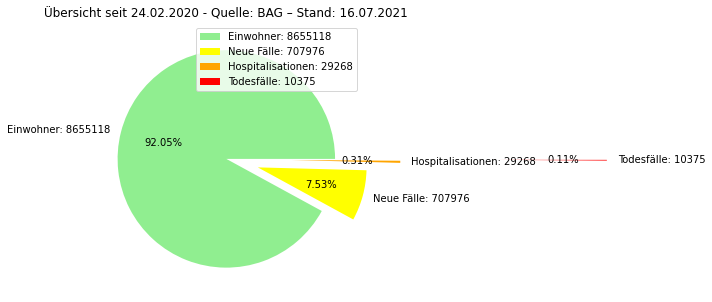
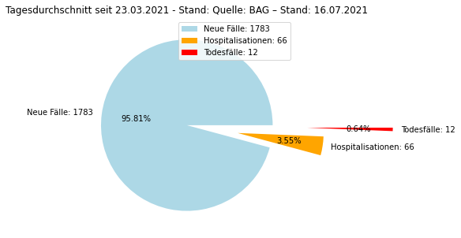
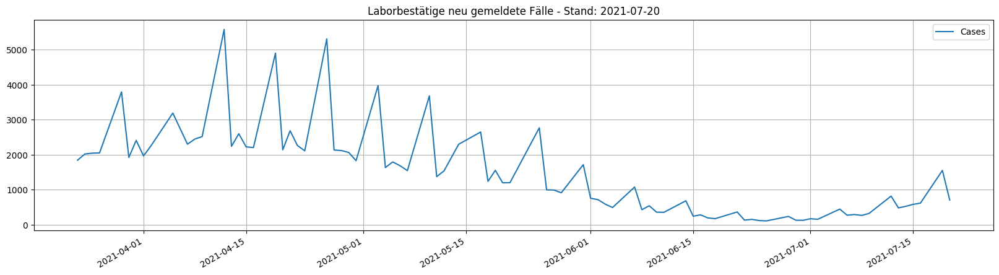
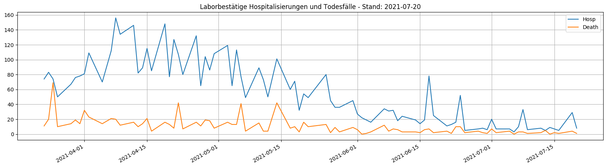

# Covid19 facts and figures der Schweiz

Mit meinem Newsreader Notebook, geschrieben in Python, suche ich nach den aktuellen Covid-Zahlen vom BAG und stelle diese grafisch dar. 

## Übersicht

Übersicht über die gesamte Zeit im Vergleich zur Gesamtbevölkerung der Schweiz.

## Tagesdurchschnitt

Der Tagesdurchschnitt basiert auf den Daten aus meiner MonoDB.

## Tagesüberblick

Quellen: [Bundesamt für Gesundheit BAG](www.covid19.admin.ch), [Bundesamt für Statistik](https://www.bfs.admin.ch/bfs/de/home/statistiken/bevoelkerung/stand-entwicklung.html)
